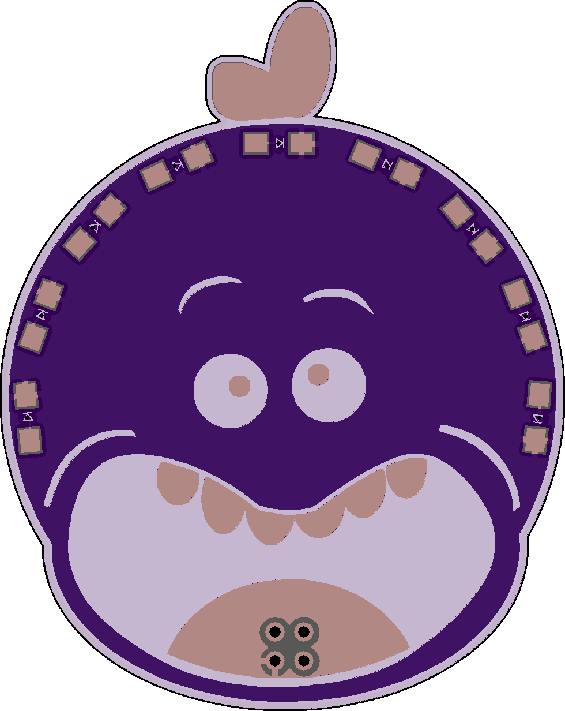

# Mr MeeSeeks Shitty Addon

A #badgelife shitty addon PCB designed for DEF CON 26.

Created by @d4rkwyng and SparX. Thanks to [AND!XOR](https://www.andnxor.com/) for their instructional video on the schematics used in this project.

## Preview

| Front | Back |
|:-:|:-:|
|  |  |

## Bill of Materials

| Ref | Component | Package | Qty |
|-----|-----------|---------|-----|
| U1 | MCP23017 | SOIC28 | 1 |
| D1-D8 | LED | 1206 | 8 |
| R1-R8 | 220 ohm | 1206 | 8 |
| C1 | 0.1uF | 1206 | 1 |
| X1 | Shitty connector | 2x2 | 1 |

## Revisions

- **Rev E** — Final revision with ESO/SSO variants
- **Rev D** — Updated layout
- **Rev C** — Routing improvements
- **Rev B** — Component changes
- **Rev A** — Initial prototype

## Project Structure

```
mrmeeseeks-addon/
├── design/          # Artwork, silkscreen, and soldermask KiCad footprints
├── gerbers/         # Manufacturing files (Rev D & E)
├── lib/             # KiCad component libraries
└── mrmeeseeks_*     # Schematic, PCB, and netlist files
```

## Tools

- [KiCad](https://www.kicad.org/) — Schematic and PCB design

## License

MIT License. See [LICENSE](LICENSE) file.
